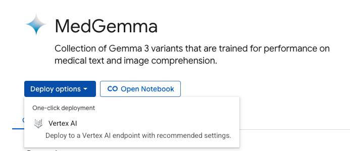

# Introduction

 MedSight uses MedGemma, a specialized vision-language model from Google, 
 to interpret a wide range of medical images — including X-rays, MRIs, CTs, skin scans, and histopathology slides. 


 

# MedSight Application 

The application is build using a Streamlit UI & Backend.


# Deploy the MedGemma model

Before using the model, we will need to deploy the model. MedGemma model is available through Google Model Garden, and Hugging Face. 
For this project we will use Model Garden. To access either of these two options, you will need to be logged in.



You will be prompted to select the MedGemma variant, the computing resource. For this project, I selected `google/medgemma-4b-it`, `Basic` deployment settings, `us-central1` region, and `vLLM 128K context (2 NVIDIA_L4; g2-standard-24)` machine spec. By pressing Deploy button, the deployment will start. It will take several minutes for the deployment to complete.

# Deploy the application with App Engine

For deploying the application with App Engine, replace the `PROJECT` with the actual value.


```bash
#!/bin/bash

# Purpose: To deploy the App to Cloud Run.

# Google Cloud Project (replace with your actual project ID)
PROJECT_ID=<YOUR_PROJECT_ID>


# Depolying app from source code
app deploy app.yaml --project $PROJECT_ID
```


