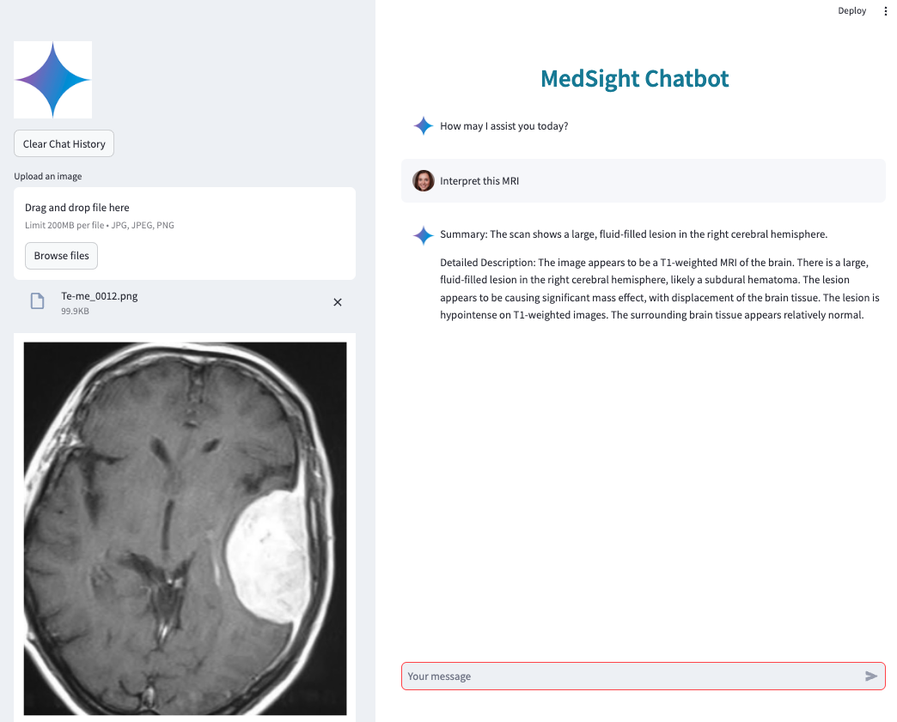

# MedSight v2.0 - AI-Powered Medical Assistant

<div align="center">



**A comprehensive, conversational, multi-modal medical AI assistant with healthcare-specific guardrails**

[](https://www.python.org/downloads/)
[](https://streamlit.io)
[](LICENSE)

</div>

---

## 🌟 Features

### 🏥 Healthcare Guardrails
- **Input Validation**: PII detection, emergency keyword detection, query sanitization
- **Output Validation**: Automatic medical disclaimers, confidence scoring
- **Safety Checks**: Critical finding detection, human review flagging
- **Compliance**: HIPAA-compliant audit logging and data handling

### 💬 Conversational Interface
- **Multi-turn Dialogue**: Maintains conversation context and history
- **Reference Resolution**: Handles "the previous scan", "that finding"
- **Session Management**: Persistent conversation sessions
- **Context-Aware Responses**: Leverages conversation history

### 🤖 Multi-Agent System
- **Routing Agent**: Intelligently classifies and routes requests
- **Image Analyzer Agent**: Analyzes medical images using MedGemma
- **Record Parser Agent**: Extracts structured information from medical documents
- **Synthesis Agent**: Combines multi-modal information
- **QA Agent**: Handles follow-up questions and explanations
- **Orchestrator**: Coordinates all agents with reflexion loop

### 📄 Multi-Modal Processing
- **Medical Images**: X-rays, MRI, CT, ultrasound, DICOM
- **Medical Records**: PDF, text documents
- **Document Parsing**: Automatic entity extraction
- **Timeline Building**: Chronological patient history
- **Multi-Modal Fusion**: Correlates images with clinical records

---

## 🏗️ Architecture

```
┌─────────────────────────────────────────┐
│         User Interface (Streamlit)      │
└──────────────┬──────────────────────────┘
               │
┌──────────────▼──────────────────────────┐
│         Input Guardrails                │
│  (Validation, PII, Emergency Detection) │
└──────────────┬──────────────────────────┘
               │
┌──────────────▼──────────────────────────┐
│         Orchestrator Agent              │
│    (Coordinates all agents)             │
└──────────────┬──────────────────────────┘
               │
       ┌───────┴───────┐
       │               │
   ┌───▼────┐     ┌───▼────────┐
   │Routing │     │  Reflexion │
   │ Agent  │     │   Loop     │
   └───┬────┘     └────────────┘
       │
   ┌───┴─────────────────────────────┐
   │                                 │
┌──▼──────────┐  ┌─────────────┐   ┌▼──────────┐
│   Image     │  │   Record    │   │ Synthesis │
│  Analyzer   │  │   Parser    │   │   Agent   │
└─────────────┘  └─────────────┘   └───────────┘
                                    
       ┌──────────────┐
       │  QA Agent    │
       └──────────────┘
               │
┌──────────────▼──────────────────────────┐
│         Output Validation               │
│  (Disclaimers, Confidence, Safety)      │
└─────────────────────────────────────────┘
```

---

## 📦 Project Structure

```
med-sight/
├── config/
│   └── guardrails.yaml              # Healthcare safety configuration
├── src/
│   ├── agents/                      # Multi-agent system
│   │   ├── base_agent.py           # Base agent class
│   │   ├── routing_agent.py        # Request routing
│   │   ├── image_analyzer_agent.py # Image analysis
│   │   ├── record_parser_agent.py  # Document parsing
│   │   ├── synthesis_agent.py      # Multi-modal synthesis
│   │   ├── qa_agent.py             # Q&A handling
│   │   └── orchestrator.py         # Agent coordination
│   ├── guardrails/                  # Healthcare safety
│   │   ├── input_validator.py      # Input validation
│   │   ├── output_validator.py     # Output validation
│   │   ├── safety_checker.py       # Safety checks
│   │   └── compliance_checker.py   # HIPAA compliance
│   ├── conversation/                # Conversation management
│   │   ├── session_manager.py      # Session lifecycle
│   │   ├── context_manager.py      # Context tracking
│   │   ├── memory_store.py         # Persistent storage
│   │   └── retrieval.py            # Context retrieval
│   ├── document_processing/         # Document processing
│   │   └── parsers/
│   │       ├── pdf_parser.py       # PDF parsing
│   │       ├── text_parser.py      # Text parsing
│   │       └── dicom_parser.py     # DICOM parsing
│   ├── models/                      # Data models
│   │   ├── message.py              # Message models
│   │   ├── medical_image.py        # Image models
│   │   ├── medical_record.py       # Record models
│   │   └── patient_data.py         # Patient data
│   └── ui/
│       └── app.py                   # Main Streamlit app
├── tests/                           # Test suite
├── docs/                            # Documentation
├── images/                          # UI assets
├── requirements.txt                 # Dependencies
├── app.yaml                         # App Engine config
├── ARCHITECTURE_RECOMMENDATIONS.md  # Architecture docs
├── IMPLEMENTATION_ROADMAP.md        # Implementation plan
├── PROJECT_SUMMARY.md              # Project summary
├── QUICK_START.md                  # Quick start guide
└── README.md                        # This file
```

---

## 🚀 Quick Start

### Prerequisites

- Python 3.10 or higher
- Google Cloud Project with Vertex AI enabled
- MedGemma model deployed to Vertex AI endpoint

### Installation

1. **Clone the repository**
   ```bash
   cd /Users/gabrielpreda/workspace/my_projects/med-sight
   ```

2. **Create virtual environment**
   ```bash
   python -m venv venv
   source venv/bin/activate  # On Mac/Linux
   # or
   venv\Scripts\activate  # On Windows
   ```

3. **Install dependencies**
   ```bash
   pip install -r requirements.txt
   ```

4. **Configure environment variables**
   
   Create a `.env` file:
   ```env
   PROJECT_ID=your-gcp-project-id
   REGION=us-central1
   ENDPOINT_ID=your-medgemma-endpoint-id
   ENDPOINT_REGION=us-central1
   ```

5. **Run the application**
   ```bash
   streamlit run src/ui/app.py
   ```

6. **Access the application**
   
   Open your browser to `http://localhost:8501`

---

## 📖 Usage

### Basic Image Analysis

1. Upload a medical image (X-ray, MRI, CT, etc.)
2. Ask: "Analyze this chest X-ray"
3. Review the structured findings with confidence scores

### Multi-Modal Analysis

1. Upload medical images and records (PDF/text)
2. Ask: "Compare this X-ray with my medical history"
3. Get comprehensive analysis correlating imaging with clinical data

### Follow-up Questions

1. After receiving analysis, ask: "What does 'costophrenic angle' mean?"
2. Get educational explanations in context

### Emergency Detection

- System automatically detects emergency keywords
- Provides immediate guidance to seek emergency care
- Does NOT provide emergency medical advice

---

## 🔒 Safety & Compliance

### Medical Disclaimers

All outputs include appropriate medical disclaimers:
- General disclaimer for informational purposes
- Diagnostic disclaimer for preliminary findings
- Emergency notice when emergency keywords detected
- Limitation notice for low-confidence results

### Confidence Scoring

- 🟢 **High** (≥85%): High confidence in findings
- 🟡 **Medium** (65-85%): Moderate confidence, review recommended
- 🔴 **Low** (<65%): Low confidence, human review required

### HIPAA Compliance

- Audit logging of all interactions
- PII detection and redaction
- Data encryption
- Configurable data retention policies

---

## 🧪 Testing

Run the test suite:

```bash
# Run all tests
pytest tests/ -v

# Run with coverage
pytest tests/ --cov=src --cov-report=html

# View coverage report
open htmlcov/index.html
```

---

## 📚 Documentation

- **[Architecture Recommendations](ARCHITECTURE_RECOMMENDATIONS.md)**: Detailed technical architecture
- **[Implementation Roadmap](IMPLEMENTATION_ROADMAP.md)**: 9-week implementation plan
- **[Project Summary](PROJECT_SUMMARY.md)**: Executive summary and examples
- **[Quick Start Guide](QUICK_START.md)**: Step-by-step setup instructions

---

## 🛠️ Configuration

### Guardrails Configuration

Edit `config/guardrails.yaml` to customize:
- Emergency keywords
- Blocked patterns
- PII detection rules
- Confidence thresholds
- Medical disclaimers

### Agent Configuration

Agents can be configured via the orchestrator config:

```python
orchestrator = Orchestrator(
    endpoint=endpoint,
    config={
        'enable_reflexion': True,
        'max_context_messages': 10,
        'confidence_threshold': 0.65
    }
)
```

---

## 🚢 Deployment

### Google App Engine

```bash
gcloud app deploy app.yaml --project=YOUR_PROJECT_ID
```

### Docker (Optional)

```bash
docker build -t medsight .
docker run -p 8501:8501 medsight
```

---

## 🤝 Contributing

Contributions are welcome! Please:

1. Fork the repository
2. Create a feature branch
3. Make your changes
4. Add tests
5. Submit a pull request

---

## ⚠️ Important Disclaimers

### Medical Disclaimer

**THIS SOFTWARE IS FOR INFORMATIONAL AND EDUCATIONAL PURPOSES ONLY.**

- This is NOT a medical device
- This is NOT FDA approved
- This is NOT a substitute for professional medical advice
- Always consult qualified healthcare professionals
- Do NOT use for emergency medical situations

### Liability

The developers and contributors of this software:
- Make NO warranties about accuracy or reliability
- Accept NO liability for medical decisions made using this software
- Strongly recommend professional medical review of all findings

### Emergency Situations

**IF YOU ARE EXPERIENCING A MEDICAL EMERGENCY:**
- Call 911 (or your local emergency number) immediately
- Go to the nearest emergency room
- Do NOT rely on this software for emergency medical care

---

## 📄 License

This project is licensed under the MIT License - see the [LICENSE](LICENSE) file for details.

---

## 🙏 Acknowledgments

- **Google MedGemma**: For the specialized medical vision-language model
- **Google Cloud Vertex AI**: For model deployment infrastructure
- **Streamlit**: For the web application framework

---

## 📧 Contact

For questions, issues, or contributions:
- Open an issue on GitHub
- Review the documentation
- Check existing issues and discussions

---

## 🗺️ Roadmap

### Completed ✅
- Multi-agent architecture
- Healthcare guardrails
- Conversational interface
- Multi-modal document processing
- Basic UI

### In Progress 🚧
- Advanced NLP for entity extraction
- FHIR/HL7 integration
- Enhanced timeline visualization
- Mobile-responsive UI

### Planned 📋
- Integration with EHR systems
- Advanced image comparison
- Multi-language support
- API endpoints for integration
- Advanced analytics dashboard

---

<div align="center">

**Built with ❤️ for Healthcare**

[Documentation](docs/) | [Issues](https://github.com/your-repo/issues) | [Discussions](https://github.com/your-repo/discussions)

</div>
